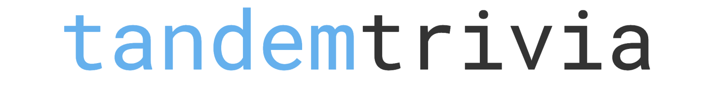
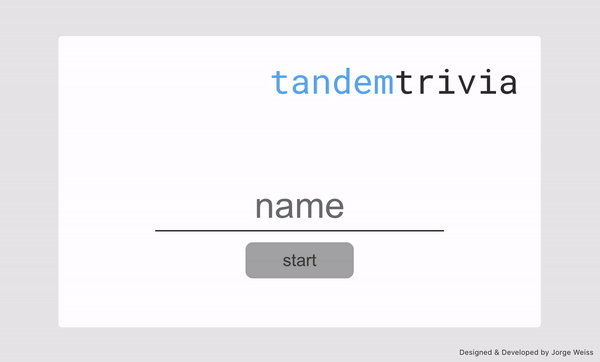

`tandemtrivia`is the best way and easiest way to play trivia online. 

## installation and tests

Change directory to root and then run the following command:
###`npm install`

Once all Dependencies have been installed the command below will run the application in your default browser
### `npm start`

Runs the app in the development mode.\
Open [http://localhost:3000](http://localhost:3000) to view it in the browser.

If you make any changes to any of the files while the app is running, Create React app will automatically re-run the application with the updated changes. 

The command below will cause all the tests to run.
### `npm test`

## About testing
Tests use the tool React-Testing-Library which tests based on how users interact with the application.
For example, the tests check what happens when the user types a name in the field on home screen and then submits the form - does it go on to the next correct screen?

More information about React Testing Library can be found here: [React Testing Library](https://testing-library.com/docs/react-testing-library/intro)

## Styling
All styling was done using pure CSS instead of a framework like Bootstrap. One tool that was used, however, is an icon for the timer. The icon is coming from [FontAwesome](https://fontawesome.com/).

## Some known bugs 🐞
- Currently, one a user clicks on one of the answer choices, the answer choices randomly shift order again due to the re-rendering of the parent component. This is not good for User Experience. 
- Helper function array shuffle can be improved to prove that the function returns a new array with contents that are shuffled in a way that the test pass 100% of the time. 

